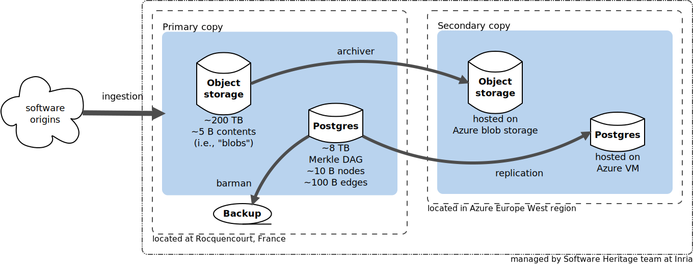

:orphan:

.. _archive-copies:

Archive copies
==============

.. _swh-storage-copies-layout:

   Layout of Software Heritage archive copies (click to zoom).

The Software Heritage archive exists in several copies, to minimize the risk of
losing archived source code artifacts. The layout of existing copies, their
relationships, as well as their geographical and administrative domains are
shown in the layout diagram above.

We recall that the archive is conceptually organized as a graph, and
specifically a Merkle DAG, see :ref:`data model <data-model>` for more
information.

Ingested source code artifacts land directly on the **primary copy**, which is
updated live and also used as reference for deduplication purposes. There,
different parts of the Merkle DAG as stored using different backend
technologies. The leaves of the graph, i.e., *content objects* (or "blobs"),
are stored in a key-value object storage, using their SHA1 identifiers as keys
(see :ref:`persistent identifiers <persistent-identifiers>`). SHA1 collision
avoidance is enforced by the :mod:`swh.storage` module. The *rest of the graph*
is stored in a Postgres database (see :ref:`SQL storage <sql-storage>`).

At of 2022-09-27, the primary object storage contains about 12 billion
blobs with a median size of 3 KB---yes, that is *a lot of very small
files*---for a total compressed size of about 800 TB. The Postgres database
takes about 8 TB (compressed), half of which is used by indexes. In terms of
graph metrics, the Merkle DAG has about 26 B nodes and 370 B edges.

The **secondary copy** is hosted on Microsoft Azure cloud, using its native
blob storage for the object storage and a large virtual machine to run a
Postgres instance there. The database is kept up-to-date w.r.t. the primary
copy using Postgres WAL replication. The object storage is kept up-to-date
using :mod:`swh.archiver`.

Archive copies (as opposed to archive mirrors) are operated by the Software
Heritage Team at Inria. The primary archived copy is geographically located at
Rocquencourt, France; the secondary copy hosted in the Europe West region of
the Azure cloud.
